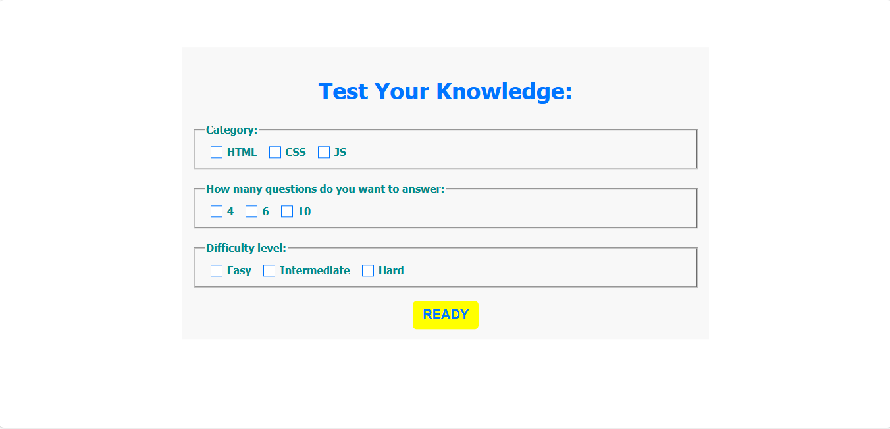
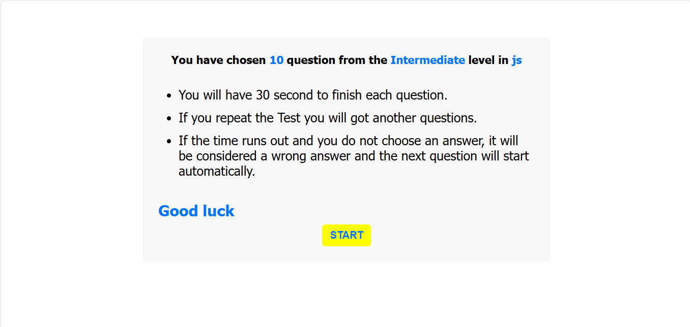
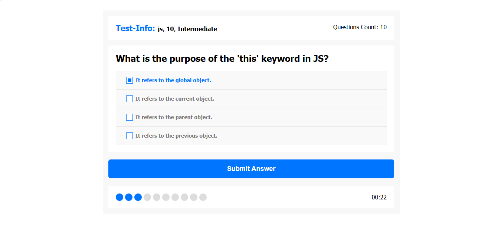

# quiz-application
A simple quiz application built with HTML, CSS, and JavaScript. This project allows users to test their knowledge in various categories and difficulty levels.

## Table of contents

- [Overview](#overview)
  - [Usage](#Usage)
  - [Links](#links)
  - [Screenshot](#Screenshot)
- [My process](#my-process)
  - [Features](#Features)
  - [JSON Files](#JSON-Files)
  - [What I learned](#what-i-learned)
  - [Continued development](#continued-development)
- [Author](#author)
- [Acknowledgments](#Acknowledgments)

## overview
This project is a quiz application designed to help users test their knowledge in HTML, CSS, and JavaScript. Users can select the category, number of questions, and difficulty level to customize their quiz experience. The application provides immediate feedback and results at the end of the quiz.

## Usage
1. Open the application.
2. Select the quiz category, number of questions, and difficulty level.
3. Click "READY" to start the quiz.
4. Read the instructions.
5. Answer the questions within the given time.
6. View your results and feedback at the end of the quiz.

### Links

If you want to open the link in a new tab, you can:

- Press **Ctrl** (or **Cmd** on Mac) while clicking the link.
- Right-click the link and select **Open link in new tab**.

Otherwise, all links will open in the same tab.

- Solution URL: [here](https://github.com/olahasan/quiz-application)

- Live Site URL: [here](https://olahasan.github.io/quiz-application/)

 ## Screenshot
 

## my-process

## Features
- Select quiz category (HTML, CSS, JS)
- Choose the number of questions (4, 6, 10)
- Select difficulty level (Easy, Intermediate, Hard)
- Timer for each question
- Dynamic question and answer generation
- Results and feedback at the end of the quiz

## JSON Files
The project includes 9 JSON files for storing quiz questions:
- 3 for HTML (Easy, Intermediate, Hard)
- 3 for CSS (Easy, Intermediate, Hard)
- 3 for JavaScript (Easy, Intermediate, Hard)

## what-i-learned
Through this project, I enhanced my skills in:
- **HTML**: Structuring web content and using semantic elements.
- **CSS**: Styling web pages, using flexbox for layout, and implementing transitions.
- **JavaScript**: Handling events, manipulating the DOM, and making asynchronous requests.
- **JSON Files**: sending and receiving data from a JSON Files asynchronously. This means you can update parts of a web page without refreshing the whole page.

## Continued Development
In the future, I plan to:
- Add more categories and questions.
- Implement a backend to store user scores and progress.
- Enhance the UI/UX with more animations and responsive design.

### Author

GitHub - @olahasan

### Acknowledgments

I would like to thank the **[Elzero Web School](https://elzero.org/)** for providing this challenge and to the community for their support.

